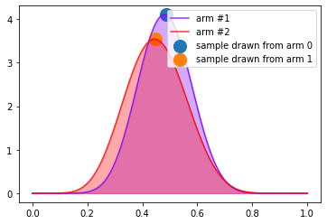

# Project name here
> Summary description here.


This file will become your README and also the index of your documentation.

## Install

`pip install your_project_name`

## How to use

Fill me in please! Don't forget code examples:

```python
from thompson_sampling_edu.multi_armed_bandits import non_contextual_categorical_customer_reaction
```

```python
from thompson_sampling_edu.solvers import BetaBandit
```

```python

bb = BetaBandit()
for i in range(250):
    if i in [0,1,2,5,10,25,35,50,75,100,250]:
        plt.figure()
        arm = bb.choose_arm_and_plot()
    else:
        arm = bb.choose_arm()
        reward = non_contextual_categorical_customer_reaction(arm,theta=[0.3,0.6])
        bb.update(arm,reward)

```





```python

from nbdev.export import *
notebook2script()
```

    Converted 00_abstractions.ipynb.
    Converted 01_multi_armed_bandits.ipynb.
    Converted 02_models.ipynb.
    Converted 03_ensembles.ipynb.
    Converted 04_solvers.ipynb.
    Converted index.ipynb.

