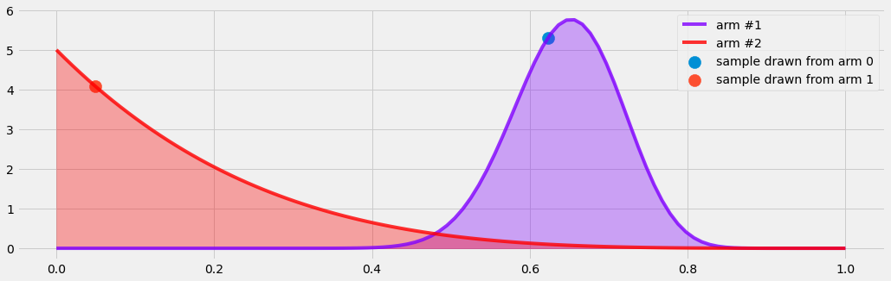
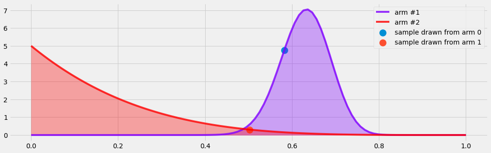
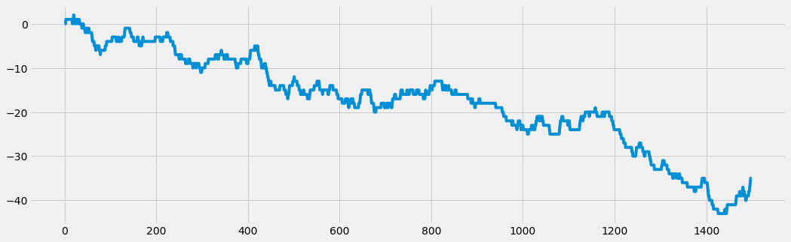

# Project name here
> Summary description here.


```python
from thompson_sampling.helpers import plot_regret
```

```python
theta = [0.6, 0.3]

theta_contextual = [1.6, 0.4]


num_data = 1500
X = np.linspace(-6, 6, num_data)
X = shuffle(X)
noise = 0.1

```

This file will become your README and also the index of your documentation.

## Install

`pip install your_project_name`

## How to use

Fill me in please! Don't forget code examples:

# Categorical Reward

This section deals with rewards of categorical nature, i.e. yes/no, 0/1, ...

Note that our approaches are only built to take two categories. 

### non-contextual case

The non-contextual case does.. well... not use context.

```python
from thompson_sampling.multi_armed_bandits import non_contextual_categorical_bandit
```

```python
from thompson_sampling.solvers import BetaBandit
```

```python

bb = BetaBandit()

y_optimal_list = []
y_hat_list= []
for i in range(250):
    if i in [0,1,2,5,10,50,75,250]:
        plt.figure()
        arm = bb.choose_arm_and_plot()
    else:
        arm = bb.choose_arm()
    reward = non_contextual_categorical_bandit(arm,theta)
    bb.update(arm,reward)
    y_hat_list.append(int(reward))
        
    y_optimal = non_contextual_categorical_bandit(np.argmax(theta),theta)
    y_optimal_list.append(y_optimal)

```








```python
plot_regret(y_optimal_list, y_hat_list)
```


## contextual Case

```python
from thompson_sampling.multi_armed_bandits import contextual_categorical_bandit, contextual_categorical_get_optimal_arm
```

#### BONUS: contextual bandit with noncontextual solver

```python
bb = BetaBandit()

y_hat_list = []
y_optimal_list = []

for i in progress_bar(range(num_data)):
    context = X[i]
    if i  in [0,5,10, 100, num_data//2, num_data]:
        plt.figure()
        arm = bb.choose_arm_and_plot()
    else:
        arm = bb.choose_arm()
    y_hat = contextual_categorical_bandit(context,arm, theta_contextual,noise)[0]
    y_hat_list += [y_hat]
    bb.update(arm, y_hat)
    y_optimal = contextual_categorical_bandit(context, contextual_categorical_get_optimal_arm(context), theta_contextual, noise)[0]
    y_optimal_list.append(y_optimal)


plt.figure()
plt.scatter(X,np.array(y_hat_list),c=range(len(y_hat_list)))


```


<div>
    <style>
        /* Turns off some styling */
        progress {
            /* gets rid of default border in Firefox and Opera. */
            border: none;
            /* Needs to be in here for Safari polyfill so background images work as expected. */
            background-size: auto;
        }
        .progress-bar-interrupted, .progress-bar-interrupted::-webkit-progress-bar {
            background: #F44336;
        }
    </style>
  <progress value='1500' class='' max='1500' style='width:300px; height:20px; vertical-align: middle;'></progress>
  100.00% [1500/1500 00:05<00:00]
</div>


    <matplotlib.collections.PathCollection at 0x7f617e375610>


```python
plot_regret(y_optimal_list, y_hat_list)
```


### contextual solver

```python
from thompson_sampling.models import OnlineLogisticRegression
from thompson_sampling.solvers import LogisticThompsonSampler
```

```python
lts = LogisticThompsonSampler(OnlineLogisticRegression, num_arms=2, num_context = 1)
```

```python
y_hat_list = []
y_optimal_list = []
arms = []

for i in progress_bar(range(num_data)):
    context = X[i]
    
#     if i % (num_data/10) == 0:
#         plt.figure()
#         arm = lts.choose_arm_and_plot(context)
#     else:
    arm = lts.choose_arm(context)
        
        
    #arm = lts.choose_arm(context)
    arms.append(arm)

    y_hat = contextual_categorical_bandit(context,arm, theta_contextual,noise)[0]
    y_hat_list += [y_hat]

    lts.update(arm, context, y_hat)

    y_optimal = contextual_categorical_bandit(context, contextual_categorical_get_optimal_arm(context), theta_contextual, noise)[0]
    y_optimal_list.append(y_optimal)
plt.figure()
plt.scatter(X,np.array(y_hat_list),c=range(len(y_hat_list)))


```


<div>
    <style>
        /* Turns off some styling */
        progress {
            /* gets rid of default border in Firefox and Opera. */
            border: none;
            /* Needs to be in here for Safari polyfill so background images work as expected. */
            background-size: auto;
        }
        .progress-bar-interrupted, .progress-bar-interrupted::-webkit-progress-bar {
            background: #F44336;
        }
    </style>
  <progress value='1500' class='' max='1500' style='width:300px; height:20px; vertical-align: middle;'></progress>
  100.00% [1500/1500 00:03<00:00]
</div>


    <matplotlib.collections.PathCollection at 0x7f617e35ec90>


```python
plot_regret(y_optimal_list, y_hat_list)
```





# nbdev stuff

```python

from nbdev.export import *
notebook2script()
```

    Converted 00_abstractions.ipynb.
    Converted 01_multi_armed_bandits.ipynb.
    Converted 02_models.ipynb.
    Converted 03_ensembles.ipynb.
    Converted 04_solvers.ipynb.
    Converted 99_helpers.ipynb.
    Converted index.ipynb.


```python
! nbdev_build_docs
```

    converting: /home/thomas/Documents/GitHub/thompson_sampling/index.ipynb
    converting /home/thomas/Documents/GitHub/thompson_sampling/index.ipynb to README.md


```python
! nbdev_install_git_hooks
```

    Executing: git config --local include.path ../.gitconfig
    Success: hooks are installed and repo's .gitconfig is now trusted


```python
# nbdev_fix_merge filename.ipynb
```
